# RoboMaster Systems Fundamentals

A small, step-by-step Python project for learning how a computer system works
through a robot.

This edition focuses on **input, process, working memory, output, feedback,
wireless communication, encryption, computer vision, AI, and AI agents**. It is
not a search-and-rescue application or an autonomous mission planner.

The laptop code is observation-only: every example keeps the chassis output at
`STOP`. A separate RoboMaster S1 Lab example makes state visible with the
robot's LEDs and sound. Test Lab code with the drive wheels raised and a teacher
at the controls.

The previous mission-oriented implementation is recoverable in Git history at
commit `2f54bc7`.

## Learn in this order

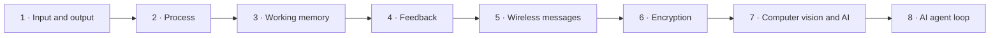

| Step | Run | Question answered | Robot illustration |
| --- | --- | --- | --- |
| 1 | `python -m steps.step_01_input_output` | What enters and leaves a system? | distance/button in; LED, screen, sound, and STOP out |
| 2 | `python -m steps.step_02_process` | What does Python do with raw values? | centimetres become UNKNOWN, NEAR, or CLEAR |
| 3 | `python -m steps.step_03_memory` | Why remember a previous tick? | repeated or stale sensor sequences are not treated as new |
| 4 | `python -m steps.step_04_feedback` | Why read the world again after acting? | the next sensor reading checks what changed |
| 5 | `python -m steps.step_05_wireless` | How does data cross the air? | a named message becomes bytes; delay or loss produces HOLD/STOP |
| 6 | `python -m steps.step_06_encryption` | How can people on the link be kept from reading or changing data? | a message is locked; changed encrypted bytes are rejected |
| 7 | `python -m steps.step_07_vision_ai` | How are computer vision and AI different? | a pixel rule is compared with an uncertain model prediction |
| 8 | `python -m steps.step_08_agent` | What makes an AI agent a system? | observe, remember, decide, output, and observe again |

Do not skip directly to the agent. An agent is understandable only after every
smaller box is understandable.

## The whole computer system

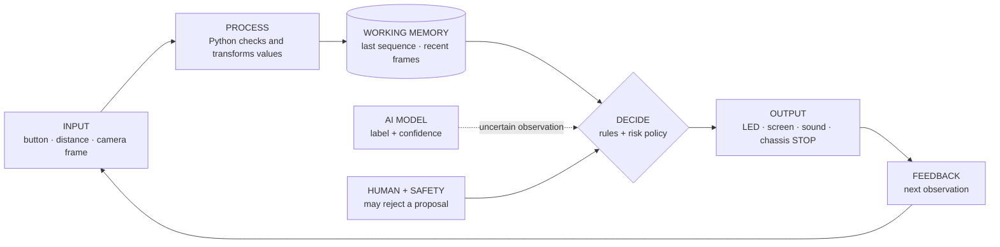

- **Input** is data entering the boundary.
- **Process** changes or checks that data.
- **Working memory** is temporary state used by the next tick.
- **Decision** selects an allowed output.
- **Output** is a visible, audible, stored, or physical effect.
- **Feedback** is new input showing what happened.

Python connects all six. Python is a programming language; it is not itself AI.

## One Python tick

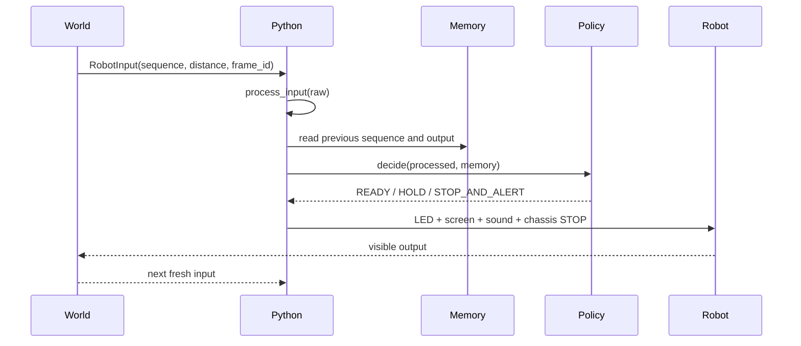

Open `fundamentals/system.py` and follow the fields in `SystemTrace`. The
trace exists so a student can point to evidence instead of saying “the robot
thought.”

## Where code runs

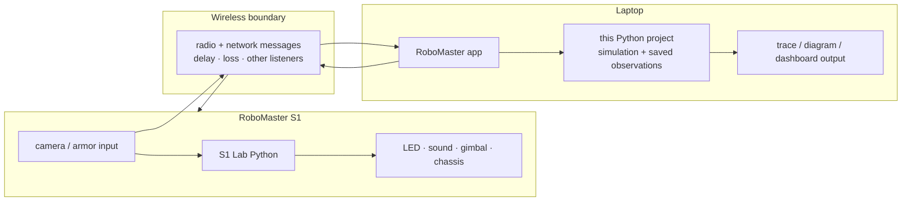

The RoboMaster app and robot use their own connection protocol. This project
does not imitate that protocol, open a robot socket, or send motion commands.
`robot/s1_lab_input_process_memory_output.py` is the separate on-robot
boundary.

## Working memory is not every kind of storage

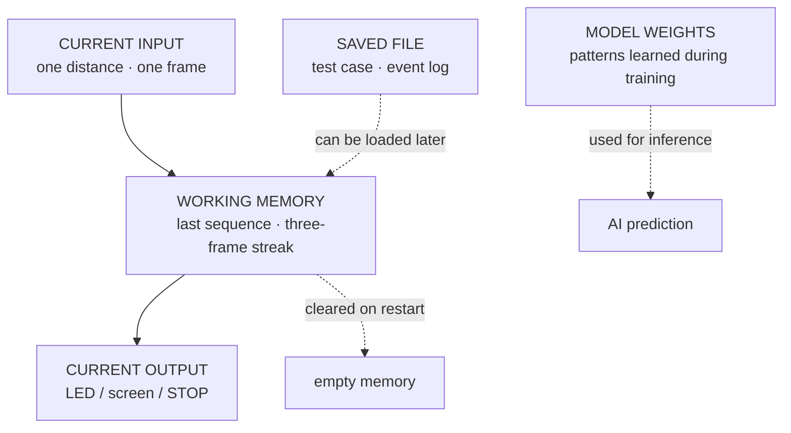

Model weights are learned parameters, not a diary of the current student or
room. A log file is stored output, not working memory.

## Wireless communication

A message has meaning inside the application. A radio carries bytes, not Python
objects or intentions.

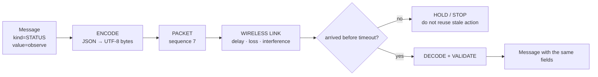

`fundamentals/communication.py` uses a deterministic `WirelessLink`
simulation. It teaches three systems ideas without pretending to be a real
radio driver:

1. **Latency:** a message arrives later.
2. **Loss:** a message may not arrive.
3. **Freshness:** sequence numbers keep an old packet from becoming a new action.

## Encoding is not encryption

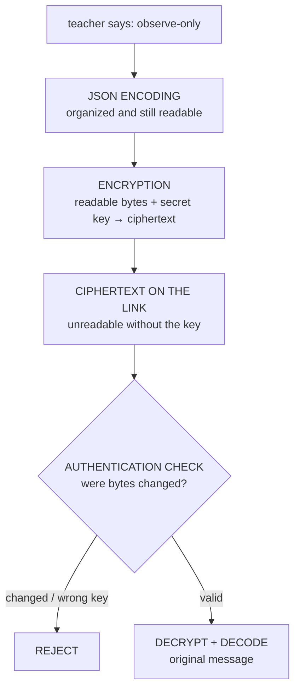

Think of the layers this way:

- **Encoding** is writing the same message in a standard form.
- **Encryption** is putting it in a locked box so outsiders cannot read it.
- **Authentication/integrity** is a tamper-evident seal and sender check.
- **Authorization** is the rule deciding what an identified sender may do.

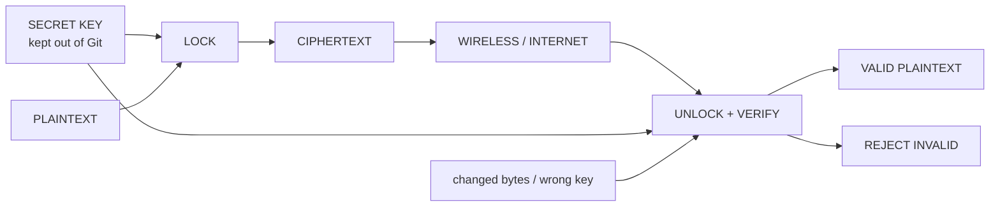

The demo uses the maintained `cryptography` library's Fernet format. It
provides authenticated symmetric encryption for this classroom message. It is
not a replacement for network security.

### Security is layered

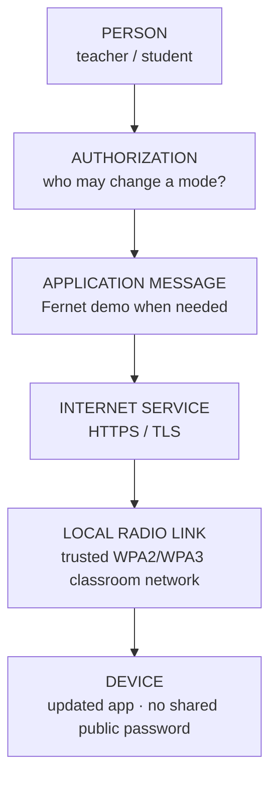

Rules for students:

- Never invent a cipher for real protection.
- Never commit, print, screenshot, or chat a secret key.
- A Wi-Fi password does not decide which app user is a teacher.
- Encryption does not make a dangerous command safe.
- If a message is missing, late, malformed, changed, or unauthorized, use a
  non-moving output.

## Computer vision is not always AI

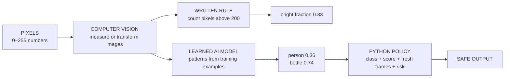

`measure_bright_region` is computer vision with an explicit pixel rule.
`AIPrediction` represents output from a learned model. The project uses
saved predictions so the fundamentals run without downloading a large model.
An AI adapter can be added later without changing the system interfaces.

## Confidence is not certainty

The numbers below are comparison values for class, not production defaults.
Real thresholds require fixed validation data from the actual camera, lighting,
distance, and student environment.

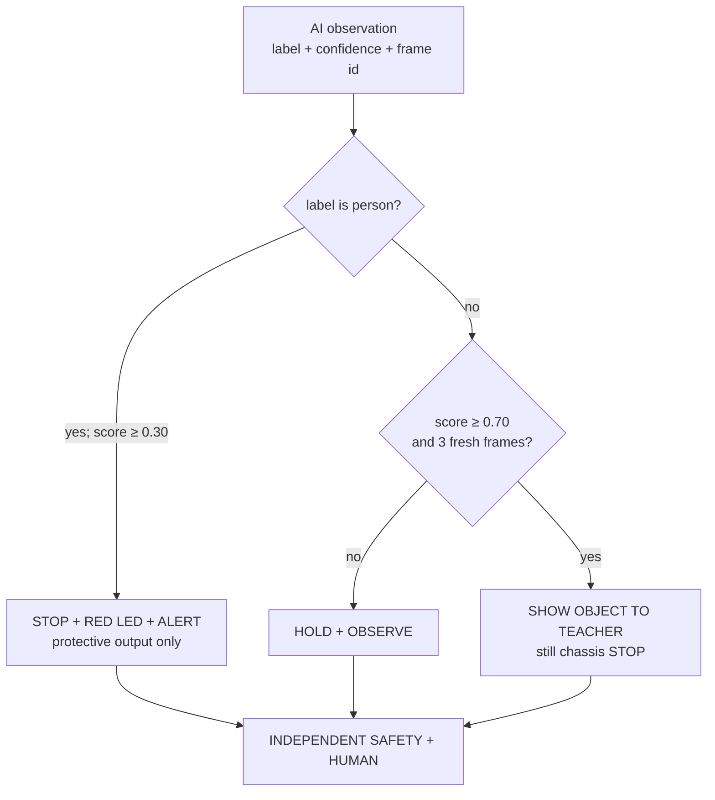

A possible person may use a lower threshold because missing a person can cost
more than an unnecessary stop. Lowering that threshold makes the robot **easier
to stop**, never easier to approach a person.

## What is an AI agent?

An AI prediction alone is not an agent. An agent has a goal and repeatedly
observes, remembers, decides, produces an output, and checks what happened.

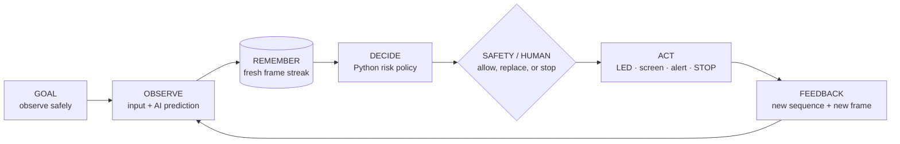

`RobotAgent` is deliberately hybrid:

- AI supplies an uncertain observation.
- Python owns memory, thresholds, validation, and orchestration.
- deterministic safety rules can override the AI path;
- every output in the laptop project keeps `chassis="STOP"`.

## Project map

```text
fundamentals/
  system.py          input → process → memory → decision → output → feedback
  communication.py   message → bytes → wireless → encryption → validation
  vision.py          pixel rule, AI prediction, thresholds, fresh-frame memory
  agent.py           combines the modules into one observable loop
steps/
  step_01_...py      run these eight modules in numerical order
  ...
robot/
  s1_lab_...py       separate on-robot Lab Python boundary
tests/
  test_system.py
  test_communication.py
  test_vision.py
```

There is no mission catalog, map, autonomous navigation state machine, cloud
conversation, dashboard framework, third-party model, robot SDK bundle, or
vendor executable in this fundamentals edition.

## Quick start

Python 3.10 or newer is recommended.

```bash
python -m venv .venv
source .venv/bin/activate
python -m pip install -r requirements.txt

python -m steps.step_01_input_output
python -m steps.step_02_process
python -m steps.step_03_memory
python -m steps.step_04_feedback
python -m steps.step_05_wireless
python -m steps.step_06_encryption
python -m steps.step_07_vision_ai
python -m steps.step_08_agent

python -m unittest discover -s tests -p 'test_*.py'
```

On Windows PowerShell, activate with:

```powershell
.\.venv\Scripts\Activate.ps1
```

Steps 1–5 and 7–8 use only the Python standard library. Step 6 installs one
purpose-built dependency, `cryptography`, instead of implementing a
homemade cipher.

## Teach the same system at three depths

| Level | Student explanation | Student work |
| --- | --- | --- |
| Upper elementary | “The sensor sends a clue. Python sorts it. Memory keeps the last clue. The robot shows an answer.” | role cards, arrows, LED colors, packet envelopes |
| Middle school | “A message becomes bytes; sequence numbers detect stale input; a confidence is compared with an output-specific threshold.” | run steps, change values, record traces, draw packet loss |
| High school | “Typed interfaces separate inference from policy; authenticated encryption protects confidentiality and integrity; tests enforce fail-closed outputs.” | read modules, add boundary tests, compare false positives/negatives, audit key handling |

The code stays the same. Only the precision of the explanation changes.

## Safety and privacy boundary

- Begin with saved inputs and the laptop dry-run.
- Keep physical RoboMaster motion in a separate S1 Lab program.
- First Lab tests use raised drive wheels and direct teacher supervision.
- Camera and microphone data need consent and a stated retention rule.
- A model confidence is evidence, not permission to move.
- A lost wireless message, invalid key, stale frame, exception, or unknown input
  produces HOLD or STOP.
- Do not use this classroom project for safety-critical operation.
